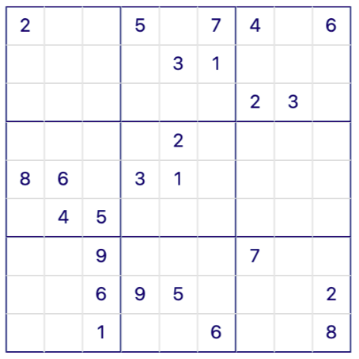
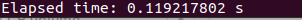
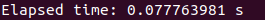

# Sudoku Solver with Dancing Links (DLX)



## Dancing Links (DLX)

In computer science, dancing links is a technique for reverting the operation of deleting a node from a circular doubly linked list.
It is particularly useful for efficiently implementing backtracking algorithms, such as Donald Knuth's Algorithm X for the exact cover problem.
Algorithm X is a recursive, nondeterministic, depth-first, backtracking algorithm that finds all solutions to the exact cover problem. Some of the
better-known exact cover problems include tiling, the n queens problem, and Sudoku.

The name dancing links, which was suggested by Donald Knuth, stems from the way the algorithm works, as iterations of the algorithm cause the links
to "dance" with partner links so as to resemble an "exquisitely choreographed dance." Knuth credits Hiroshi Hitotsumatsu and Kōhei Noshita with
having invented the idea in 1979,[2] but it is his paper which has popularized it.

### Main ideas

The idea of DLX is based on the observation that in a circular doubly linked list of nodes,

```
x.left.right ← x.right;
x.right.left ← x.left;
```

will remove node x from the list, while

```
x.left.right ← x;
x.right.left ← x;
```

will restore x's position in the list, assuming that x.right and x.left have been left unmodified. This works regardless of the number of elements
in the list, even if that number is 1.

Knuth observed that a naive implementation of his Algorithm X would spend an inordinate amount of time searching for 1's. When selecting a column,
the entire matrix had to be searched for 1's. When selecting a row, an entire column had to be searched for 1's. After selecting a row, that row
and a number of columns had to be searched for 1's. To improve this search time from complexity O(n) to O(1), Knuth implemented a sparse matrix
where only 1's are stored.

At all times, each node in the matrix will point to the adjacent nodes to the left and right (1's in the same row), above and below (1's in the
same column), and the header for its column (described below). Each row and column in the matrix will consist of a circular doubly-linked list of
nodes.

## Results

top95.txt - HARD Puzzles\


easy50.txt - EAZY Puzzles\

